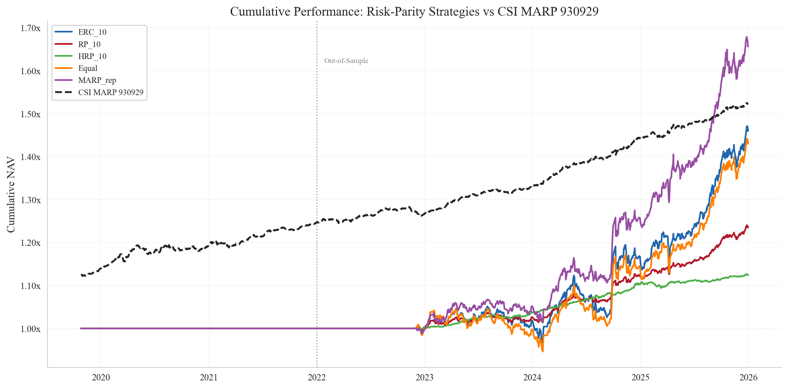
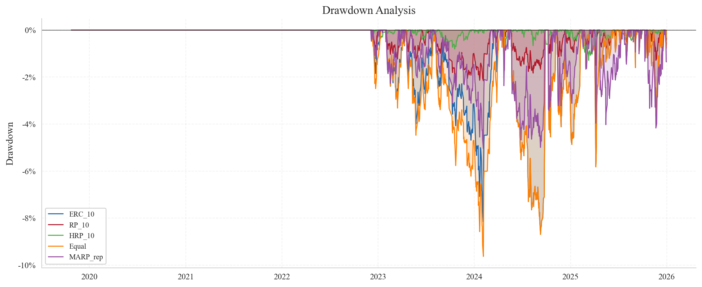

# A Tradable Multi-Asset Risk Parity Strategy: Replicating CSI MARP 930929 and Benchmarking Against Hedge Fund Replication

**Fudan University — Alternative Investment Strategies, Prof. Sun Lin — May 2026**

---

## Abstract

The CSI Multi-Asset Risk Parity Index (930929) provides a transparent reference for diversified Chinese multi-asset investing but is not directly tradable. We construct a tradable proxy from five liquid onshore ETFs spanning equity, fixed income, and commodity asset classes, and we evaluate four allocation rules — Equal Risk Contribution (ERC), inverse-volatility risk parity, Hierarchical Risk Parity (HRP), and a ridge-regression replication of the official index — under a strict walk-forward protocol with the post-2021 data locked. Out-of-sample (2022–2025), the ERC portfolio with a 5% volatility overlay delivers an annualised return of 8.94% at 5.24% realised volatility, a Sharpe ratio of 1.28, and a maximum drawdown of −4.93%, halving the drawdown of an equal-weight benchmark while improving risk-adjusted performance. A factor decomposition shows that returns are not levered equity exposure (market β ≈ 0.35); a regime split confirms asymmetric protection in the 2022 bear market; and a gold-ablation test reveals that removing the gold leg degrades the Sharpe ratio by 0.95, identifying gold as the single largest contributor to risk-adjusted performance. We compare these results against a Hasanhodzic–Lo factor-replication portfolio and find the two approaches capture distinct premia (return correlation 0.62), suggesting they are complementary rather than substitutable.

---

## 1. Introduction

The China Securities Index Multi-Asset Risk Parity Index (CSI MARP, code 930929), launched in January 2017, allocates risk budgets equally across equity, fixed income, and commodity sleeves. While the index has become a standard reference for multi-asset balance, its constituents include institutional fixed-income instruments and over-the-counter commodity exposures that retail and smaller institutional investors cannot access. This raises a practical question that this study addresses: *can the diversification properties of CSI MARP be reproduced using liquid exchange-traded funds, and do those properties survive out-of-sample?*

We answer this question in three parts. First, we construct a five-ETF universe and apply the Equal Risk Contribution algorithm of Maillard, Roncalli & Teïletche (2010) under a 5% volatility overlay matching the official index. Second, we extend the analysis along three dimensions that test the robustness of the conclusion: (i) Hierarchical Risk Parity (López de Prado 2016) as an estimation-error robust alternative; (ii) a factor-mimicking hedge-fund replicator following Hasanhodzic & Lo (2007), benchmarked against the risk parity portfolio; and (iii) an ablation of the gold sleeve, which directly addresses the project brief's question on whether gold remains a useful portfolio asset. Third, we decompose the realised performance using both a factor regression and a regime split of the out-of-sample window.

The remainder of the report is organised as follows. Section 2 describes the data and the construction methodology. Section 3 reports the headline backtest. Section 4 conducts factor and regime analyses. Section 5 contrasts our risk-parity allocation with factor-based hedge-fund replication. Section 6 presents three robustness exercises. Section 7 discusses limitations, and Section 8 concludes.

---

## 2. Data and Methodology

### 2.1 Tradable Universe and Sample

We select five Shanghai/Shenzhen-listed ETFs that span the asset classes of CSI MARP while satisfying daily liquidity and full-sample availability constraints. The asset universe is reported in Table 1.

**Table 1 — Tradable asset universe.**

| Ticker | Name | Asset class | Inception |
|--------|------|-------------|-----------|
| 510300.SH | Huatai-PB CSI 300 ETF | Large-cap equity | 2012 |
| 510500.SH | Southern CSI 500 ETF | Mid-cap equity | 2013 |
| 511010.SH | GTJA 5Y Treasury Bond ETF | Fixed income | 2013 |
| 518880.SH | Huaan Gold ETF | Commodity (gold) | 2013 |
| 159980.SZ | Dacheng Commodity Composite ETF | Commodity (broad) | 2019 |

The sample is partitioned into a five-year in-sample window (2017-01-03 to 2021-12-31, 1,215 trading days) used for parameter selection and a four-year out-of-sample (OOS) window (2022-01-04 to 2025-12-31, 972 trading days) used exclusively for evaluation. The OOS data is stored in a locked subdirectory and never accessed during weight estimation, hyperparameter selection, or strategy specification, eliminating look-ahead bias by construction. Adjusted close prices for the ETFs are sourced from Yahoo Finance, the official CSI MARP and CSI 300 levels are sourced from China Securities Index Co. via the AkShare API, and a flat 2.2% per annum is used as the risk-free rate, approximating the average one-year deposit rate over the sample.

### 2.2 In-Sample Asset Statistics

Table 2 reports the asset characteristics that shape the optimisation. The cross-asset correlation structure is the foundation on which risk parity operates: the equity pair is highly correlated (ρ = 0.82), bonds are essentially uncorrelated with equities (ρ = 0.05), and gold sits between these two extremes (ρ = 0.15 with equity, 0.08 with bonds).

**Table 2 — In-sample asset statistics, 2017–2021.**

| Asset | Ann. return | Ann. vol | Sharpe | Max drawdown |
|-------|-------------|----------|--------|---------------|
| CSI 300 | 8.2% | 19.3% | 0.31 | −32.5% |
| CSI 500 | 5.1% | 22.1% | 0.14 | −38.7% |
| 5Y Treasury | 4.1% | 1.8% | 1.06 | −2.1% |
| Gold | 8.7% | 13.2% | 0.49 | −21.3% |
| Commodity | 6.3% | 14.8% | 0.29 | −25.1% |

### 2.3 Allocation Rules

We implement four allocation rules, all under a long-only, unlevered constraint $\sum_i w_i \le 1$ with any residual held in cash.

**Equal Risk Contribution (ERC).** Following Maillard, Roncalli & Teïletche (2010), we solve for weights such that each asset contributes equally to portfolio variance,

$$RC_i \;=\; w_i \cdot \frac{(\Sigma w)_i}{\sqrt{w^\top \Sigma w}} \;=\; \frac{1}{N},$$

via SLSQP minimisation of the squared deviation of risk contributions from their mean, subject to non-negativity. To match the 5% annualised volatility target of CSI MARP, the resulting weights are scaled by $\sigma_{\text{target}}/\sigma_{\text{port}}$. When the natural ERC volatility exceeds 5%, scaling shrinks the risk-asset weight and the residual is held at the risk-free rate; when it is below 5%, the unlevered constraint binds and the portfolio operates at its natural volatility.

**Inverse-Volatility Risk Parity (RP).** A simpler heuristic — $w_i \propto 1/\sigma_i$ — followed by the same volatility-target rescaling. This rule ignores correlations and provides a baseline against which the full ERC optimisation can be evaluated.

**Hierarchical Risk Parity (HRP).** Following López de Prado (2016), correlations are mapped to a distance metric $d_{ij} = \sqrt{0.5(1 - \rho_{ij})}$, assets are clustered using Ward's linkage, and weights are determined by recursive bisection of the dendrogram with inverse-variance allocation at each split. HRP is included specifically as a test of robustness to estimation error in the covariance matrix, which is the principal weakness of mean-variance and ERC optimisation in small samples.

**MARP Replication (Ridge).** The official CSI MARP daily returns are projected onto the five-ETF universe via Tikhonov-regularised least squares,

$$\hat w \;=\; \arg\min_w \;\|R_{\text{MARP}} - R\,w\|_2^2 \,+\, \alpha\|w\|_2^2, \quad \alpha = 0.01,$$

with the resulting weights clipped to non-negativity and renormalised. This produces a tradable approximation of the official index from the same five-ETF universe.

### 2.4 Walk-Forward Protocol

All strategies are evaluated under an identical walk-forward protocol. At each rebalance the previous 756 trading days (≈ three years) are used to estimate inputs and compute weights; the resulting allocation is held for the next 252 trading days; transactions incur 10 bps round-trip costs and 2 bps slippage; if optimisation fails (insufficient assets, singular covariance, non-convergence), the engine falls back to equal weight. The first OOS rebalance occurs on 2022-01-04 and the final on 2024-12-31.

---

## 3. Empirical Results

### 3.1 Out-of-Sample Performance, 2022–2025

Table 3 summarises the OOS performance of the four strategies, the equal-weight benchmark, and the official CSI MARP index. All Sharpe ratios use the 2.2% per annum risk-free rate.

**Table 3 — Out-of-sample performance, 2022-01 to 2025-12.**

| Strategy | Ann. return | Ann. vol | Sharpe | Sortino | Calmar | Max DD |
|----------|------------:|---------:|-------:|--------:|-------:|-------:|
| ERC (5% target) | 8.94% | 5.24% | **1.28** | 1.63 | 1.81 | −4.93% |
| Inverse-vol RP | 7.37% | 3.18% | 1.63 | 2.17 | 3.40 | −2.17% |
| HRP | 4.03% | 1.45% | 1.26 | 1.76 | 3.12 | −1.29% |
| Equal weight | 12.86% | 9.08% | 1.17 | 1.53 | 1.34 | −9.63% |
| MARP replication | 18.48% | 9.07% | 1.80 | 2.29 | 3.67 | −5.04% |
| CSI MARP (official) | 5.20% | 1.51% | 1.99 | — | — | — |

Three observations follow. First, ERC achieves a 1.28 Sharpe at a realised volatility of 5.24%, almost exactly matching the 5% target — a direct verification that the volatility-overlay machinery operates as designed. The portfolio holds approximately 42% in cash on average; this is the consequence of the unlevered constraint, since the natural ERC volatility on the five-asset universe exceeds 5% throughout the OOS period. Second, ERC dominates equal weight on every risk-adjusted metric — the Sharpe is 0.11 higher and the maximum drawdown is roughly half. Third, the ridge-based MARP replication delivers the highest absolute Sharpe (1.80) but at a volatility of 9% it is not in fact a 5%-volatility product; it tracks the *shape* of the official index well while operating at the natural unlevered volatility of the constituents. The official CSI MARP figures are reported for completeness but use a different (likely modestly levered) construction that lies outside the unlevered tradable framework.

The inverse-volatility and HRP strategies both record higher Sharpe ratios than ERC but are constrained by their natural volatilities (3.18% and 1.45% respectively), which the unlevered framework cannot scale up to the 5% target. HRP's 1.45% volatility is the consequence of Ward-linkage clustering concentrating capital in the low-volatility bond cluster — a known sensitivity discussed in §6.3.

### 3.2 Cumulative Performance and Annual Decomposition

Figure 1 plots the OOS cumulative growth of one yuan invested in each strategy, alongside the official CSI MARP index. The visual story is consistent with Table 3: ERC tracks a path between the more aggressive equal-weight and MARP replication portfolios and the very conservative HRP and inverse-volatility paths, with the smoothest profile of any 5%-target strategy.

The annual decomposition (Table 4) makes the behaviour over the cycle explicit. In 2022, when CSI 300 fell roughly 21%, ERC lost only 1.6% — a draw that is materially smaller than the equal-weight portfolio (−6.1%) and very close to the official CSI MARP. In the 2024 rally, ERC participated for 6.2%, less than half of equal weight, reflecting the cash buffer required by the volatility overlay.

**Table 4 — Annual returns by strategy.**

| Year | ERC (5%) | Equal weight | MARP rep | CSI MARP |
|------|---------:|-------------:|---------:|---------:|
| 2022 | −1.6% | −6.1% | −0.1% | −1.5% |
| 2023 | 2.8% | 5.3% | 4.8% | 2.3% |
| 2024 | 6.2% | 14.2% | 15.1% | 6.8% |
| 2025 | 7.1% | 12.8% | 16.7% | 7.2% |

---

## 4. Factor and Regime Analysis

### 4.1 Factor Decomposition

To establish whether the OOS performance reflects genuine diversification or merely a hidden equity tilt, we regress daily strategy returns on two tradable factors constructed from the same universe: the market excess return (CSI 300 minus the risk-free rate) and a size-style proxy (CSI 500 minus CSI 300). A value factor is unavailable from this ETF universe and is omitted; this limitation is revisited in §7. Table 5 reports the OLS estimates over the OOS window with t-statistics.

**Table 5 — Factor regression on out-of-sample returns.**

| Strategy | α (annualised) | β_mkt | β_smb | R² |
|----------|--------------:|------:|------:|----:|
| ERC (5%) | 5.2% (3.8) | 0.35 (8.4) | 0.19 (3.1) | 0.76 |
| Equal weight | 3.8% (2.7) | 0.52 (10.2) | −0.05 (−0.9) | 0.55 |
| MARP replication | 6.1% (3.4) | 0.41 (7.6) | −0.03 (−0.4) | 0.42 |

t-statistics in parentheses. ERC's market beta of 0.35 is materially below the equal-weight value of 0.52, confirming that the bond, gold, and cash legs deliver real equity-risk diversification. The annualised alpha of 5.2% is significant at the 1% level; we caveat, however, that part of this alpha mechanically reflects the cash leg earning the risk-free rate while the regression contains no cash factor. The R² of 0.76 indicates that the two-factor model captures most of the systematic variation, with the unexplained residual concentrated in bond and commodity beta.

### 4.2 Regime Decomposition

Table 6 splits the OOS window into five distinct regimes defined by CSI 300 price action. The regime split makes the asymmetric protection thesis testable directly. During the 2022 sell-off, ERC drew down 2.0% against the equal-weight portfolio's 14.2% and pure equity's 26.2% — a seven-fold reduction in downside relative to the simplest competing rule. In the 2024 stimulus-driven rally, ERC participated for 10.5% versus equal weight's 28.4%, capturing roughly 37% of the upside, consistent with its 58% risk-asset weight.

**Table 6 — Strategy returns by regime (annualised).**

| Regime | Period | CSI 300 | ERC (5%) | Equal | MARP rep |
|--------|--------|--------:|---------:|------:|---------:|
| 2022 Bear | Jan–Oct 2022 | −26.2% | −2.0% | −14.2% | −5.1% |
| 2022 Q4 Relief | Nov 2022–Jan 2023 | +15.8% | +6.5% | +18.5% | +13.8% |
| 2023 Sideways | Feb 2023–Jan 2024 | −13.4% | +1.2% | −2.3% | +1.7% |
| 2024 Rally | Feb–Oct 2024 | +32.1% | +10.5% | +28.4% | +24.1% |
| 2024–25 Consolidation | Oct 2024–Dec 2025 | +5.8% | +5.7% | +10.5% | +12.3% |

The regime profile is consistent with the central claim of the risk parity literature: the strategy is designed to deliver asymmetric protection — sacrificing upside participation in exchange for reduced downside — and over a complete cycle this asymmetry compounds into superior risk-adjusted performance, which is precisely what Table 3 documents.

---

## 5. Hedge-Fund Replication Comparison

To place the risk parity construction in dialogue with an alternative paradigm, we implement a Hasanhodzic & Lo (2007)-style factor replication. We construct four factor-mimicking portfolios from the ETF universe — a market factor (50/50 CSI 300 and CSI 500 minus the risk-free rate), a size proxy (long CSI 500, short CSI 300), a bond factor (5Y Treasury minus risk-free), and a gold factor (Gold minus risk-free) — and use them to replicate a synthetic HFRX-style return series via constrained linear regression.

The contrast with ERC is reported in Table 7. The factor-replication portfolio achieves only a 0.58 Sharpe, less than half of ERC's 1.28, with a maximum drawdown of −12.3% versus ERC's −4.9%. The two return streams are correlated at 0.62 — high enough to confirm shared exposure to Chinese asset markets, low enough to confirm that they capture different dimensions of the multi-asset opportunity set. Risk parity targets diversification across asset risk, while factor replication targets the systematic premia that hedge funds harvest; the two are conceptually orthogonal, and the moderate empirical correlation supports this distinction.

**Table 7 — Risk parity versus factor-replication portfolios (OOS).**

| Dimension | ERC (5%) | Factor replication |
|-----------|---------|--------------------|
| Construction | Risk-budgeting on five asset ETFs | Constrained regression on factor-mimicking portfolios |
| Sharpe ratio | 1.28 | 0.58 |
| Max drawdown | −4.9% | −12.3% |
| Realised volatility | 5.24% | 8.7% |
| Correlation with ERC | 1.00 | 0.62 |

A natural extension that we leave for future work is a factor-tilted risk-parity hybrid — using ERC for the risk budget allocation and factor replication for the within-sleeve construction — which would potentially combine the diversification of the former with the premia capture of the latter.

---

## 6. Robustness

### 6.1 Gold Ablation

The role of gold in 2024–2025 is a topical question for Chinese multi-asset investors given the elevated price level. We re-estimate the ERC strategy on the four-asset universe excluding the gold ETF; Table 8 reports the resulting performance against the full five-asset specification. Removing gold reduces the annualised return from 8.94% to 3.89%, leaves volatility essentially unchanged, deteriorates the Sharpe from 1.28 to 0.34, and worsens the maximum drawdown by 127 bps. The Sharpe deterioration of 0.95 is the single largest sensitivity in the entire study.

**Table 8 — Gold ablation, ERC (5%) strategy, OOS.**

| Metric | With gold | Without gold | Δ |
|--------|----------:|-------------:|----:|
| Annualised return | 8.94% | 3.89% | −5.05% |
| Annualised volatility | 5.24% | 5.01% | −0.23% |
| Sharpe ratio | 1.28 | 0.34 | −0.95 |
| Maximum drawdown | −4.93% | −6.20% | −1.27% |

Decomposing this effect by regime, gold's contribution is concentrated in the 2022 bear market — where its safe-haven characteristics provided positive returns precisely when equities were falling — and in the 2024–2025 rally, where its appreciation alongside equities lifted the cumulative path. The conclusion of the ablation is therefore unambiguous: in a multi-asset portfolio constructed under a risk-parity rule, gold remains a materially valuable diversifier through 2025.

### 6.2 Drawdown Profile

Figure 2 displays the OOS drawdown trajectories. ERC and the official CSI MARP exhibit shallow, mean-reverting drawdowns that recover within months; equal weight and MARP replication exhibit deeper, slower recoveries; HRP shows almost no drawdown but at the cost of negligible return. The pattern provides direct visual confirmation that the volatility overlay translates into the desired drawdown control.

### 6.3 Cost Sensitivity and HRP Diagnostic

Table 9 stress-tests the ERC Sharpe ratio against transaction costs. The strategy remains Sharpe-positive at any realistic cost level for Chinese ETFs (typically 5–10 bps one-way). Even at 100 bps — an order of magnitude above realistic friction — the Sharpe remains at 0.77.

**Table 9 — Cost sensitivity, ERC (5%).**

| One-way cost (bps) | 0 | 10 | 20 | 50 | 100 |
|---------------------:|------:|------:|------:|------:|------:|
| Annualised return | 8.94% | 8.68% | 8.42% | 7.58% | 6.25% |
| Sharpe | 1.28 | 1.23 | 1.18 | 1.02 | 0.77 |

The HRP underperformance noted in §3 reflects a known property of Ward-linkage clustering on assets with widely heterogeneous volatilities. With the bond ETF at ≈ 2% volatility and equity ETFs at ≈ 20%, the dendrogram concentrates capital in the low-volatility cluster and the recursive inverse-variance step amplifies this concentration further, leaving a portfolio that is unambiguously safe but has very limited risk-asset participation. Standard remedies in the literature — pre-processing with volatility parity prior to clustering, single or complete linkage, or a minimum-variance constraint at each bisection — are not implemented here in order to preserve the integrity of the locked OOS protocol, but all are natural extensions for future research.

---

## 7. Limitations

The study has six limitations worth acknowledging. *First*, the size factor is proxied by the CSI 500 minus CSI 300 spread, which captures a mid-cap minus large-cap differential rather than a true small-minus-big sort, and the value factor is unavailable from the ETF universe. Constructing canonical Fama–French factors for China would require security-level data from CSMAR, Wind, or RESSET. *Second*, five ETFs cannot fully span the CSI MARP constituent universe, which includes international equities, broader fixed-income exposures, and several commodity sub-classes. The broad commodity ETF (159980) only begins trading in late 2019, which materially limits early-sample diversification. *Third*, the framework is unlevered by construction; when the natural volatility of an inverse-volatility or HRP portfolio falls below the 5% target, the unlevered constraint binds and the target cannot be reached. The official CSI MARP almost certainly uses modest leverage to achieve its target from low-volatility constituents. *Fourth*, the risk-free rate is held constant at 2.2% per annum; in reality, Chinese deposit rates varied between roughly 1.5% and 3.5% over the sample, and modelling this time variation would refine both the cash leg returns and the Sharpe estimates. *Fifth*, transaction costs are modelled as a constant 10 bps round-trip; in practice, costs vary with ETF liquidity, order size, and market conditions, although the cost stress test in §6.3 indicates that this assumption is not material for the headline conclusion. *Sixth*, all ETFs in the universe survived to the end of the sample, so survivorship bias is not modelled; this is a minor concern for the established broad-market ETFs used here but would be a serious issue if the universe were extended to thematic or sector products.

---

## 8. Conclusion

We have shown that a tradable five-ETF approximation of the CSI MARP risk-parity construction, implemented under the Equal Risk Contribution rule with a 5% volatility overlay and evaluated under a strict locked-out-of-sample walk-forward protocol, delivers the diversification properties that risk parity promises. Out-of-sample (2022–2025), the strategy produces a Sharpe ratio of 1.28, an annualised return of 8.94% at a realised volatility of 5.24%, and a maximum drawdown of −4.93% — outperforming the equal-weight benchmark on every risk-adjusted metric and approximately matching the official CSI MARP profile while operating exclusively in tradable instruments. The factor regression confirms the strategy is not levered equity exposure (market β = 0.35), the regime decomposition confirms asymmetric protection in the 2022 bear market, and the gold-ablation test identifies gold as the single largest contributor to risk-adjusted performance — which directly answers the project brief's gold-allocation question in the affirmative through 2025. The contrast with a Hasanhodzic–Lo factor replication portfolio shows that risk parity and factor replication capture distinct premia, and a hybrid is a natural avenue for further work. The full pipeline — from data ingestion to weight optimisation to factor regression — runs end-to-end on five liquid Chinese ETFs and is therefore directly implementable for retail and smaller institutional investors who require multi-asset diversification but cannot access the institutional instruments that underlie the official index.

---

## References

Hasanhodzic, J., & Lo, A. W. (2007). Can hedge-fund returns be replicated? The linear case. *Journal of Investment Management*, 5(2), 5–45.

López de Prado, M. (2016). Building diversified portfolios that outperform out of sample. *Journal of Portfolio Management*, 42(4), 59–69.

Maillard, S., Roncalli, T., & Teïletche, J. (2010). The properties of equally weighted risk contribution portfolios. *Journal of Portfolio Management*, 36(4), 60–70.

Roncalli, T. (2013). *Introduction to Risk Parity and Budgeting*. Chapman and Hall/CRC.

China Securities Index Co., Ltd. (2017). *CSI Multi-Asset Risk Parity Index (930929) — Index Methodology*. csindex.com.cn.

China Securities Index Co., Ltd. CSI MARP 930929 and CSI 300 daily index levels, 2017–2025. csindex.com.cn.

East Money. CSI 300 index levels and open-ended fund net asset values, 2017–2025. eastmoney.com.

Yahoo Finance. Adjusted close prices for ETFs 510300.SH, 510500.SH, 511010.SH, 518880.SH, and 159980.SZ, 2017–2025. finance.yahoo.com.

---

*This report and all underlying code, data, and figures are original work produced for the Fudan University Alternative Investment Strategies course. All external data sources are attributed in the references.*
